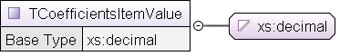
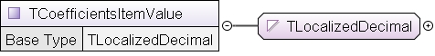
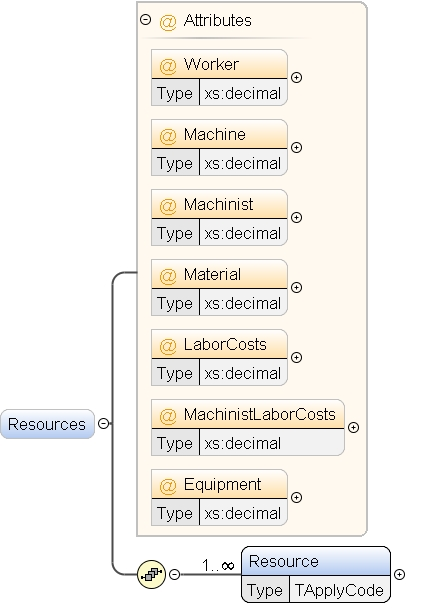
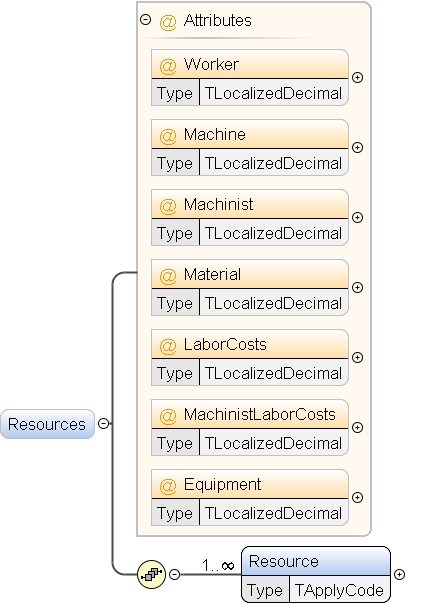

# Иллюстрации к изменению схемы (1160)

Ниже — готовые картинки (из Oxygen Schema Documentation), которые показывают суть «мягкой» схемы: добавлен тип, и им заменены 8 мест `xs:decimal`, чтобы принять десятичные значения с `,` или `.`.

## 1) Что изменилось в значении `<Value>` (было/стало)

**Было (strict):** `TCoefficientsItemValue` расширяет `xs:decimal` → значения вида `1,04` не проходят.

**Стало (relaxed):** `TCoefficientsItemValue` расширяет `TLocalizedDecimal` → допускаются `1,04` и `1.04`.

## 2) Атрибуты в `Applys/Resources` (было/стало)

Те же замены типов сделаны для атрибутов `Worker/Machine/Machinist/Material/LaborCosts/MachinistLaborCosts/Equipment`.

**Было (strict):**

**Стало (relaxed):**

## 3) Новый тип `TLocalizedDecimal` (relaxed)

Тип задаёт допустимый формат числа как строку: необязательный знак, целая часть, и опциональная дробная часть с разделителем `,` или `.`.

